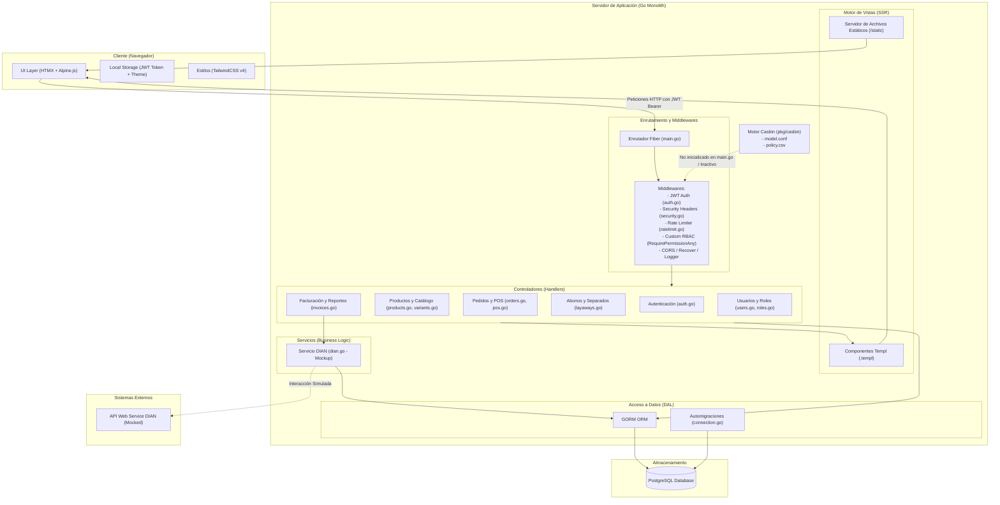

# Análisis del Estado Actual y Arquitectura del Proyecto — Nexora Shop

Este documento presenta un análisis profundo de la arquitectura de software del backend y frontend del proyecto **Nexora Shop**, detallando su estado actual, el flujo de datos, sus vulnerabilidades de concurrencia y escalabilidad, y los requerimientos pendientes que requieren investigación profunda.

---

## 1. Arquitectura del Proyecto

El proyecto está diseñado como un **Monolito Híbrido** en **Go** que proporciona dos canales de consumo:
1. **Server-Side Rendering (SSR):** Generación de interfaces HTML en el servidor utilizando **Templ** (`.templ`), dinámicamente hidratadas con **HTMX** y **Alpine.js** en el frontend.
2. **REST API:** Un conjunto completo de endpoints JSON expuestos bajo el prefijo `/api` para integraciones externas o desacoplamiento.

### Diagrama de Arquitectura (Mermaid)

El siguiente diagrama ilustra las capas lógicas del sistema, el flujo de peticiones y las interacciones con componentes externos y de persistencia:



---

## 2. Análisis del Estado Actual de la Tecnología

1. **Backend en Go (v1.25):**
   - Utiliza **Fiber v2** como framework web, caracterizado por su rapidez y bajo consumo de memoria.
   - Implementa **GORM** para la comunicación con la base de datos PostgreSQL, facilitando las automigraciones (`database.Migrate()`) y las relaciones estructuradas.
   - Centraliza la configuración en `internal/config/config.go` mediante variables de entorno (cargando parámetros de base de datos, JWT, rutas de archivos y detalles corporativos para facturación).

2. **Frontend Moderno e Interactivo (Sin Frameworks JS Complejos):**
   - **Templ:** Compila archivos de plantilla `.templ` a código de Go nativo y eficiente para renderizado ultra-rápido en el servidor.
   - **HTMX:** Permite que el frontend solicite fragmentos HTML del servidor e inyecte cambios en la página sin recargarla por completo, reduciendo la carga del cliente.
   - **Alpine.js:** Utilizado para interacciones locales ligeras en el navegador (modales, confirmaciones interactivas, menús desplegables).
   - **TailwindCSS v4:** Proporciona un sistema de diseño moderno, limpio y de fácil mantenimiento compilado en tiempo de desarrollo/construcción.

3. **Autenticación y Seguridad:**
   - Autenticación sin estado (Stateless) usando **JWT** (con tokens de acceso y refresco de larga duración).
   - El token JWT se almacena en el `localStorage` del navegador y es inyectado dinámicamente por HTMX en cada cabecera de petición mediante interceptores de eventos de ciclo de vida (`htmx:configRequest`).
   - Implementa middlewares de seguridad como CORS, protección contra inyecciones mediante cabeceras (Security Headers) y limitación de peticiones (Rate Limit) en memoria.

---

## 3. Vulnerabilidades Críticas de Escalabilidad y Concurrencia

Durante el análisis del código fuente, se identificaron varios puntos vulnerables que impedirán el escalado del sistema y podrían provocar corrupción de datos bajo condiciones de uso real:

### A. Condiciones de Carrera en la Actualización de Stock (Lost Update)
En [orders.go](file:///data/data/com.termux/files/home/projects/Shop/internal/handlers/orders.go#L146) y [layaways.go](file:///data/data/com.termux/files/home/projects/Shop/internal/handlers/layaways.go) las reducciones y adiciones de stock se realizan mediante un ciclo clásico de lectura-modificación-escritura en GORM:
```go
// Ejemplo de código vulnerable actual:
product.Stock -= item.Cantidad
tx.Model(&product).Update("stock", product.Stock)
```
*   **Problema:** Si dos cajeros realizan una venta del mismo producto en el mismo milisegundo, ambos procesos leerán el mismo stock inicial de la base de datos. Ambos restarán la cantidad vendida a ese número inicial y guardarán el resultado, lo que sobrescribirá el descuento del otro (Lost Update).
*   **Solución para Escalabilidad:** Debe realizarse una actualización atómica en SQL mediante:
    ```go
    tx.Model(&product).Update("stock", gorm.Expr("stock - ?", item.Cantidad))
    ```
    O bien, implementar bloqueo pesimista en la transacción GORM (`SELECT FOR UPDATE`):
    ```go
    tx.Clauses(clause.Locking{Strength: "UPDATE"}).First(&product, id)
    ```

### B. Sobrecarga de Base de Datos por RBAC en cada Petición
El middleware de autorización actual (`AuthMiddleware` en [auth.go](file:///data/data/com.termux/files/home/projects/Shop/internal/middleware/auth.go#L46)) carga el perfil completo del usuario, incluyendo todas sus relaciones de roles y permisos desde la base de datos PostgreSQL en **cada petición autenticada**:
```go
database.DB.Preload("Roles.Permisos").First(&user, claims.UserID)
```
*   **Problema:** Si el sistema recibe 1,000 peticiones por segundo, PostgreSQL tendrá que procesar miles de consultas de JOIN complejas solo para verificar si los tokens JWT tienen acceso a las rutas.
*   **Solución para Escalabilidad:** Introducir una capa de caché de permisos en memoria (como **Redis**). El token JWT puede validar directamente en caché la lista de permisos del usuario o almacenar los permisos serializados de forma segura dentro del payload del JWT (siempre que los claims no excedan el límite de tamaño seguro para cabeceras HTTP).

### C. Rate Limiting en Memoria Local (Dificultad de Escalado Horizontal)
El middleware de limitación de tasa ([ratelimit.go](file:///data/data/com.termux/files/home/projects/Shop/internal/middleware/ratelimit.go)) gestiona los contadores de peticiones en un mapa local en memoria de la instancia activa del servidor.
*   **Problema:** Si el backend se escala horizontalmente detrás de un balanceador de carga (ej. con 3 instancias corriendo en Docker o Kubernetes), un cliente malicioso puede evadir los límites de velocidad ya que las peticiones se distribuirán entre distintas instancias, cada una con su contador de memoria independiente.
*   **Solución para Escalabilidad:** Reemplazar el almacén en memoria local del limitador por un almacenamiento distribuido centralizado como **Redis**.

### D. Bypass Completo del Motor de Políticas Casbin
Se incluye la librería `github.com/casbin/casbin/v2` en el `go.mod` y se cuenta con los archivos de configuración [model.conf](file:///data/data/com.termux/files/home/projects/Shop/pkg/casbin/model.conf) y [policy.csv](file:///data/data/com.termux/files/home/projects/Shop/pkg/casbin/policy.csv), además del middleware correspondiente en [rbac.go](file:///data/data/com.termux/files/home/projects/Shop/internal/middleware/rbac.go).
*   **Problema:** No se está llamando a la inicialización de Casbin (`InitCasbin`) en `main.go`, ni se está aplicando su middleware en las rutas de la aplicación. En su lugar, se usa la validación artesanal `RequirePermissionAny` directamente contra el modelo de base de datos.
*   **Advertencia en la Configuración:** En el archivo `.env.docker` la ruta configurada es `internal/casbin/model.conf` pero físicamente los archivos están en `pkg/casbin/model.conf`. Al activar Casbin, el servidor fallará en Docker a menos que se corrija esta variable de entorno.

---

## 4. Requerimientos Pendientes y Áreas de Investigación Profunda

Para consolidar la escalabilidad y completar el ciclo de funcionalidades críticas de producción, se debe priorizar la investigación e implementación de las siguientes áreas:

### 1. Integración Real con la DIAN (Facturación Electrónica en Colombia)
El estado actual de [dian.go](file:///data/data/com.termux/files/home/projects/Shop/internal/services/dian.go) es un mockup que genera XML simple e imita la aceptación del servicio. Se requiere investigar e implementar:
*   **Firma Digital (XAdES-EPES):** Implementar una biblioteca en Go para firmar digitalmente las facturas XML usando el certificado digital de la empresa (generalmente en formato `.p12` o `.pfx`) y su clave privada.
*   **Algoritmo del CUFE (Código Único de Factura Electrónica):** Desarrollar la función criptográfica SHA-384 que concatena datos obligatorios de la factura (número, fecha, hora, valores, impuestos, NIT emisor, NIT adquirente, tipo de factura, y el PIN provisto por la DIAN en su catálogo técnico).
*   **Consumo de Web Services SOAP con WS-Security:** La DIAN exige el envío de las facturas firmadas en sobres SOAP mediante canales cifrados usando SSL mutuo (mTLS) y cabeceras WS-Security (firmas XML sobre el cuerpo SOAP). Se debe investigar clientes SOAP en Go (como `hooklift/gowsdl` o construcción nativa de XML) que soporten estas especificaciones de seguridad complejas.
*   **Set de Pruebas de Habilitación:** Desarrollar el flujo automatizado para enviar los rangos de prueba exigidos por la DIAN (Facturas, Notas Débito y Crédito de prueba) para obtener el estado de "Habilitado" y poder descargar la resolución oficial de producción.
*   **Generación de Representación Gráfica (PDF + QR):** Integrar una librería de generación de PDF (ej. `signintech/gopdf` o `jung-kurt/gofpdf`) que dibuje la factura con las dimensiones legales y renderice un código QR conteniendo el enlace de verificación oficial de la DIAN.

### 2. Cola de Tareas en Segundo Plano (Background Workers)
Actualmente, las acciones pesadas como el envío de facturas a la DIAN, generación de XML, envío de correos electrónicos de confirmación y el chequeo de separados vencidos se procesan sincrónicamente dentro de los hilos de petición HTTP.
*   **Investigación:** Analizar frameworks de colas de tareas asíncronas para Go respaldadas por Redis (como **Asynq** o **Machinery**).
*   **Pendiente:**
    *   Mover el envío a la DIAN a una tarea en background reintentable en caso de caídas de la red de la DIAN.
    *   Implementar un programador de tareas (Cron Job) integrado que ejecute diariamente la lógica de `layaways.Post("/check-expired")` para marcar separados vencidos automáticamente sin depender de llamadas manuales a la API.

### 3. Implementación de una Capa de Caché Distribuida
A medida que el número de productos, variantes y categorías crezca, la consulta recurrente de estos datos estáticos en PostgreSQL degradará el rendimiento.
*   **Pendiente:**
    *   Diseñar una estrategia de caché de lectura para el catálogo público (Productos, Categorías, Atributos).
    *   Configurar políticas de invalidación de caché (Write-through o TTL corto) cuando se edite un producto a través del panel de administración.

### 4. Automatización del Despliegue e Infraestructura
*   **Persistencia de Archivos:** Las imágenes de productos se almacenan de forma local en la carpeta `./tmp/uploads` dentro del contenedor. Si el contenedor se destruye o se escala a múltiples instancias, las imágenes se perderán o no estarán disponibles para los otros nodos. Es fundamental investigar e implementar el almacenamiento de archivos multimedia en un servicio en la nube compatible con S3 (ej. DigitalOcean Spaces, AWS S3 o Cloudinary) y desacoplarlo del disco local.
*   **Monitoreo y Observabilidad:** Integrar instrumentación básica para el servidor Fiber y GORM (usando Prometheus para métricas y Jaeger para trazas) para identificar cuellos de botella en producción.

---

## 5. Conclusiones y Plan de Acción Recomendado

```
Fase 1: Estabilización y Consistencia (Inmediato)
 └── Corregir los problemas de Lost Update en stock (orders.go y layaways.go)
 └── Validar y corregir las rutas de Casbin en .env.docker y definir su activación en main.go
 
Fase 2: Escalabilidad y Caché (Corto Plazo)
 └── Configurar Redis y migrar la verificación de JWT / Permisos a caché
 └── Implementar Rate Limiter distribuido (Redis-backed)
 
Fase 3: Integración Legal (Mediano Plazo)
 └── Desarrollar el firmador XML y cálculo de CUFE para la DIAN
 └── Crear cliente SOAP para comunicación real con los Web Services de la DIAN
```
